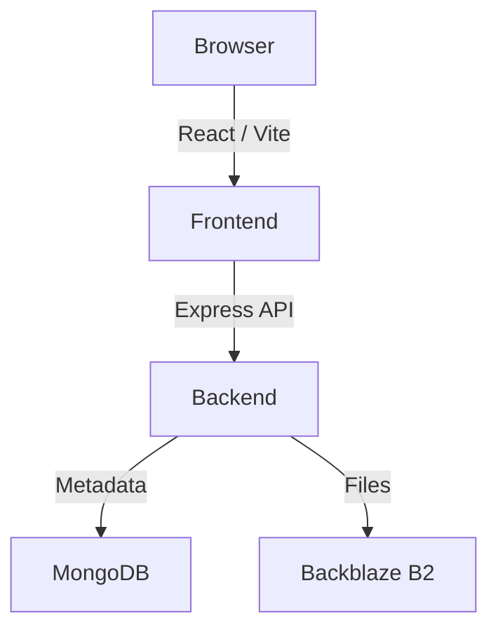

# Performance-Critical-Data-Visualization-Dashboard
# DataForge

> Performance-Critical Data Visualization Dashboard

DataForge is a performance-focused data visualization dashboard designed for large datasets and interactive visualization. It combines a React/Vite frontend with an Express + TypeScript backend, MongoDB metadata management, and Backblaze B2 native storage for dataset files.

---

## Project Overview

DataForge delivers high-performance dataset exploration with canvas-based rendering, Web Worker processing, and real-time performance monitoring. Users can upload CSV/JSON/XLSX/Parquet datasets, manage them through a workspace with rename, duplicate, delete, download, and preview capabilities, and visualize data with line charts, bar charts, scatter charts, and heatmaps.

---

## Key Features

- User authentication with JWT + HTTP-only cookies
- Dataset upload with file storage
- Dataset rename, duplicate, delete, download, and preview
- Search and pagination across datasets
- Column selection for visualization
- Canvas-based visualization rendering
- Line chart, bar chart, scatter chart, heatmap views
- Web Worker processing for large datasets
- Performance metrics: FPS, Frame Time, Render Time
- Light/dark theme support
- Dataset download via Backblaze B2

---

## Performance Focus

- Canvas rendering instead of DOM-heavy chart libraries for large datasets
- Web Workers for off-main-thread data processing
- Downsampling and optimized render paths for high-row datasets
- FPS measurement and frame-time tracking
- Responsive rendering with requestAnimationFrame
- Render-time monitoring in the performance lab

---

## Tech Stack

| Layer | Technology |
|---|---|
| Frontend | React, Vite, TypeScript, Tailwind CSS, shadcn/ui, Lucide React |
| Backend | Node.js, Express, TypeScript |
| Database | MongoDB, Mongoose |
| Storage | Backblaze B2 native API |
| Auth | JWT + HTTP-only cookies |
| Visualization | HTML Canvas |
| Performance | requestAnimationFrame, Web Workers |

---

## Architecture



MongoDB stores dataset metadata (names, columns, statistics, ownership). Actual uploaded dataset files are stored in Backblaze B2 and referenced by storage key.

---

## Project Structure

```
.
├── backend/
│   ├── src/
│   │   ├── server.ts
│   │   ├── app.ts
│   │   ├── routes/         # auth, datasets, health
│   │   ├── controllers/    # datasetController, authController
│   │   ├── services/       # b2Service
│   │   ├── middleware/     # authMiddleware
│   │   ├── config/         # env, upload
│   │   └── models/         # User, Dataset
│   ├── uploads/
│   └── .env.example
├── frontend/
│   ├── src/
│   │   ├── components/
│   │   ├── pages/
│   │   ├── hooks/
│   │   ├── api/
│   │   ├── workers/
│   │   └── lib/
│   ├── public/
│   ├── nginx.conf
│   ├── Dockerfile
│   └── .env.example
├── docker-compose.yml
├── docker-compose.prod.yml
└── README.md
```

---

## Environment Variables

### Backend (`backend/.env` or `docker-compose`)

| Variable | Description | Example |
|---|---|---|
| `NODE_ENV` | Environment mode | `production` |
| `PORT` | Express port | `3001` |
| `CLIENT_URL` | Frontend origin | `http://localhost` |
| `MONGODB_URI` | MongoDB connection URI | `mongodb://mongo:27017/dataforge` |
| `JWT_SECRET` | JWT signing secret | `change-me` |
| `UPLOAD_DIR` | Multer upload path | `./uploads` |
| `B2_KEY_ID` | Backblaze B2 key | `your-key-id` |
| `B2_APPLICATION_KEY` | Backblaze B2 app key | `your-app-key` |
| `B2_BUCKET_ID` | Backblaze B2 bucket ID | `your-bucket-id` |
| `B2_BUCKET_NAME` | Backblaze B2 bucket name | `your-bucket-name` |

### Frontend (`frontend/.env` or build args)

| Variable | Description | Example |
|---|---|---|
| `VITE_API_BASE_URL` | API base URL | `/api` (nginx proxy) or `http://localhost:3001/api` |

---

## Local Development

**Frontend:**
```bash
npm install
npm run dev
```

**Backend:**
```bash
cd backend
npm install
npm run dev
```

The backend uses `ts-node-dev` for development. The frontend runs via Vite at `http://localhost:5173`.

---

## Production Build

```bash
# Frontend
npm run build

# Backend
cd backend
npm run build
npm start
```

The backend starts with `node dist/server.js` on port `3001`. The frontend build outputs to `dist/` and is served by nginx.

---

## Docker Setup

Build images and run with local MongoDB:

```bash
docker compose build
docker compose up -d
```

For production with external MongoDB (e.g., Atlas):

```bash
docker compose -f docker-compose.prod.yml build
docker compose -f docker-compose.prod.yml up -d
```

View logs:
```bash
docker compose logs -f
```

Stop:
```bash
docker compose down
```

Services:
- `frontend` — nginx serving React build (port 80)
- `backend` — Express API with health checks (port 3001)
- `mongodb` — local MongoDB with named volume (port 27017, optional)

---

## API Overview

| Method | Endpoint | Auth | Description |
|---|---|---|---|
| GET | `/api/health` | No | Health check with DB status |
| POST | `/api/auth/register` | No | User registration |
| POST | `/api/auth/login` | No | User login |
| POST | `/api/auth/logout` | No | Clear cookie / logout |
| GET | `/api/auth/me` | Yes | Current user profile |
| POST | `/api/datasets` | Yes | Upload dataset file |
| GET | `/api/datasets` | Yes | List datasets (search/pagination) |
| GET | `/api/datasets/:id` | Yes | Get dataset metadata |
| PATCH | `/api/datasets/:id` | Yes | Update dataset (rename) |
| POST | `/api/datasets/:id/duplicate` | Yes | Duplicate dataset |
| DELETE | `/api/datasets/:id` | Yes | Delete dataset |
| GET | `/api/datasets/:id/download` | Yes | Download file from B2 |
| GET | `/api/datasets/:id/data` | Yes | Get dataset data/preview |

---

## Authentication

DataForge uses JWT stored in an HTTP-only cookie (`cookie-parser` + `jsonwebtoken`). The JWT secret must be configured via `JWT_SECRET`. Authentication middleware protects dataset endpoints. No JWT secret is exposed in source or Docker images.

---

## Dataset Storage

- **MongoDB** = dataset metadata (name, columns, statistics, owner, B2 storage key)
- **Backblaze B2** = actual dataset files uploaded via native HTTP API (`b2Service`)

Backblaze B2 credentials (`B2_KEY_ID`, `B2_APPLICATION_KEY`, `B2_BUCKET_ID`, `B2_BUCKET_NAME`) are required for upload/download and are read only from environment variables.

---

## Performance Metrics

- **FPS** — Frames per second measured during rendering
- **Frame Time** — Milliseconds per render frame
- **Render Time** — Time spent in canvas/render pipeline

These are tracked in the Performance Lab and Performance Overview components.

---

## Future Improvements

- Additional chart types (heatmap optimization, 3D scatter)
- Real-time collaboration on datasets
- Server-side dataset preprocessing
- Additional storage backends (optional, not replacing B2)

---

## License

MIT License — see repository for details.

---

*DataForge — Assignment: Performance-Critical Data Visualization Dashboard*
